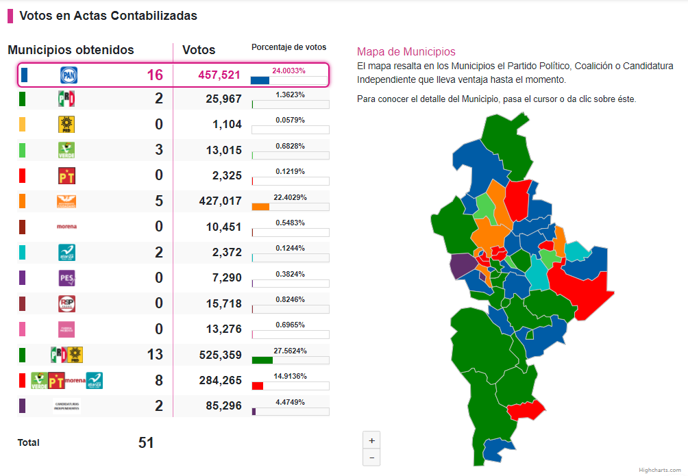
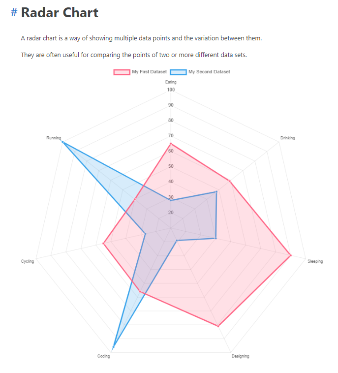
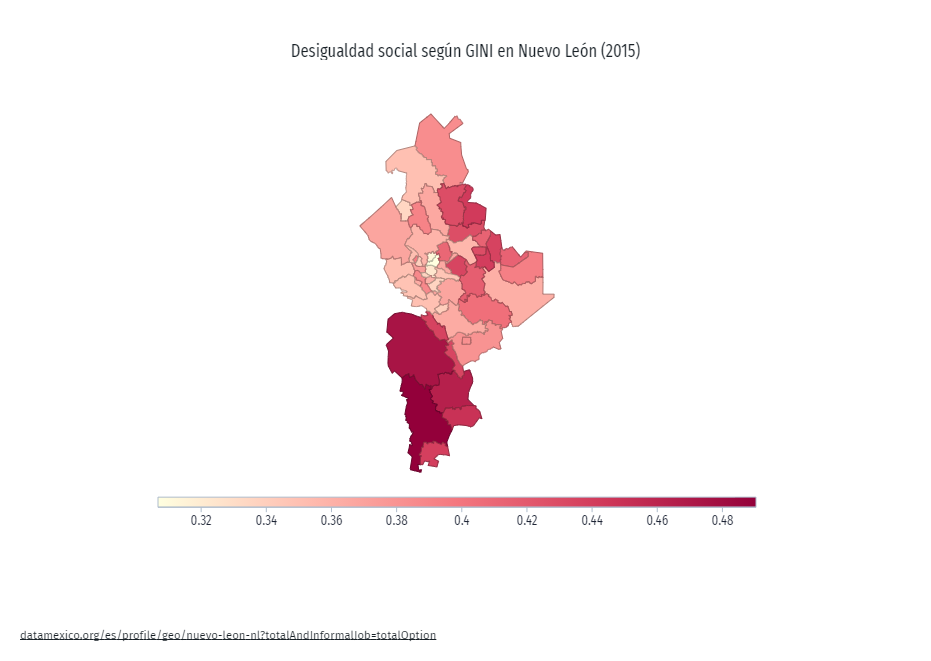

# Elections_Project
### Electoral Analysis of Nuevo León

### Contributors

+ Pablo Villalpando
+ Raúl Maya
+ Ricardo Pérez
+ Fernando Nuñez
+ Roberto Miranda

### Project Summary

Explore Nuevo Leon's election results from 2021 and its evolution from past election to discover the main sociodemographic metrics effect over the people’s voting preference.

**Project Outline:** 
https://docs.google.com/document/d/1PTsk3bbKGaR3K514hCuUtOojC-BtaWy3CoEWIORVozA/edit?usp=sharing

### Data Sources

+ Instituto Nacional Electoral (INE)
+ Comisión Estatal Electoral de Nuevo León (CEENL)
+ Censo de Población y Vivienda 2020 (INEGI)
+ DataMÉXICO

### Visualization Inspiration

| Dashboard |
| --- |
|  |

| Radar Chart | Choropleth Map |
| --- | --- |
|  |  |
